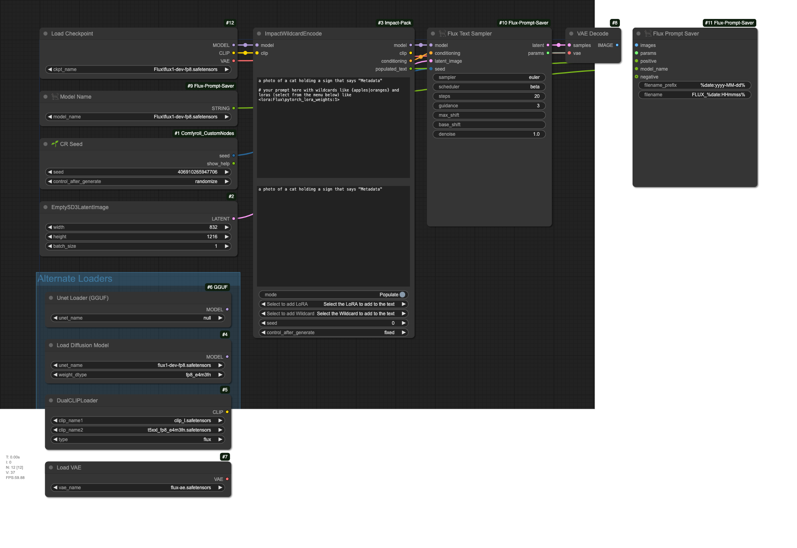

# ComfyUI Flux Prompt Saver

Custom nodes for ComfyUI to save images with standardized metadata that's compatible with common Stable Diffusion tools (Discord bots, prompt readers, image organization tools). Now includes its own sampling node copied from an earlier version of ComfyUI Essentials to maintain compatibility without requiring additional dependencies.

## Nodes

### 🐈‍⬛ Flux Text Sampler
- Copy of the Flux Sampler Parameters node from ComfyUI Essentials (pre-LoRA version)
- Works exactly like the original with ImpactWildcardEncode and other prompt nodes
- Provides consistent parameter output format that many SD tools can read
- Accepts integer seeds directly from primitive nodes

### 🐈‍⬛ Flux Prompt Saver
- Enhanced control with separate path and filename inputs
- Flexible date formatting with `%date:FORMAT%` syntax
- Automatically finds models across multiple directories (checkpoints, models, unet, diffusion_models)
- Creates output directories as needed
- Embeds comprehensive parameter metadata in saved images

### 🐈‍⬛ Model Name
- Provides model selection from all available model directories
- Simple string output for use with other nodes
- Helps handle different model types without modifying loaders

## Installation

```bash
git clone https://github.com/markuryy/ComfyUI-Flux-Prompt-Saver
```

> Note: Also available through ComfyUI Manager

## Breaking Changes in 2.0.0

- Split save location into separate path and filename inputs
- Removed dependency on ComfyUI Essentials
- Added built-in `🐈‍⬛ Flux Text Sampler` (copy of original Flux Sampler Parameters)
- Added `🐈‍⬛ Model Name` node for simpler model selection
- Changed to `%date:FORMAT%` syntax for date formatting

## Usage

### File Path Formatting
The save_path and filename inputs support various placeholder patterns:
- Date formats: `%date:FORMAT%` where FORMAT is any strftime format
  - Example: `%date:yyyy-MM-dd%` for folder path
  - Example: `FLUX_%date:HHmmss%` for filename
- Image properties: `%width%`, `%height%`, `%seed%`

### Example Paths
```
save_path: %date:yyyy-MM-dd%
filename: FLUX_%date:HHmmss%
# Results in: output/2024-01-30/FLUX_143022_00000_.png
```

## Example Workflow



Drag and drop the above image into ComfyUI to load the workflow (the workflow JSON is embedded in the image).

### Required Nodes for Example
- [ComfyUI-Impact-Pack](https://github.com/ltdrdata/ComfyUI-Impact-Pack)
- [ComfyUI-Custom-Scripts](https://github.com/pythongosssss/ComfyUI-Custom-Scripts)
- [ComfyUI_Comfyroll_CustomNodes](https://github.com/RockOfFire/ComfyUI_Comfyroll_CustomNodes)

While no longer required, [ComfyUI_essentials](https://github.com/cubiq/ComfyUI_essentials) is still recommended for its other useful nodes.

## Credits
- Original Flux Sampler Parameters node by [cubiq](https://github.com/cubiq)
- ComfyUI Essentials: https://github.com/cubiq/ComfyUI_essentials